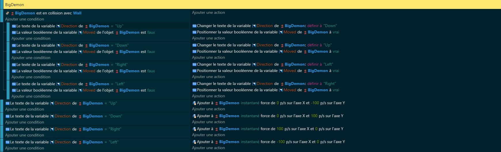
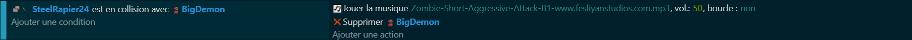
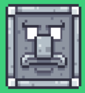
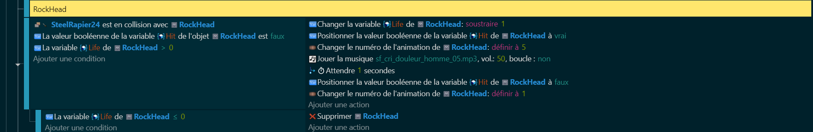
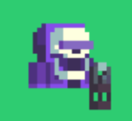
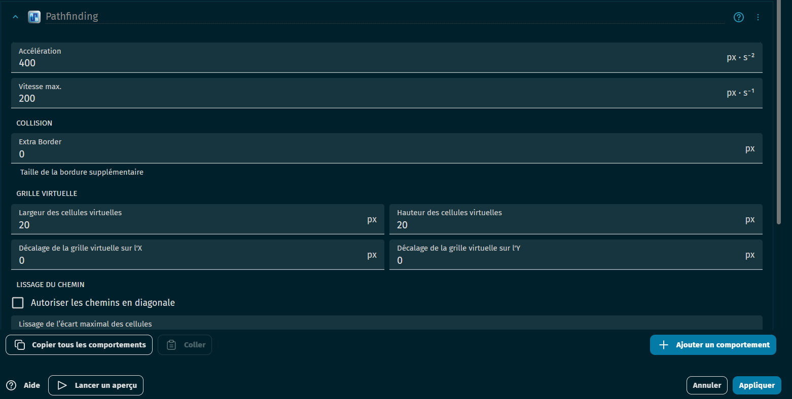
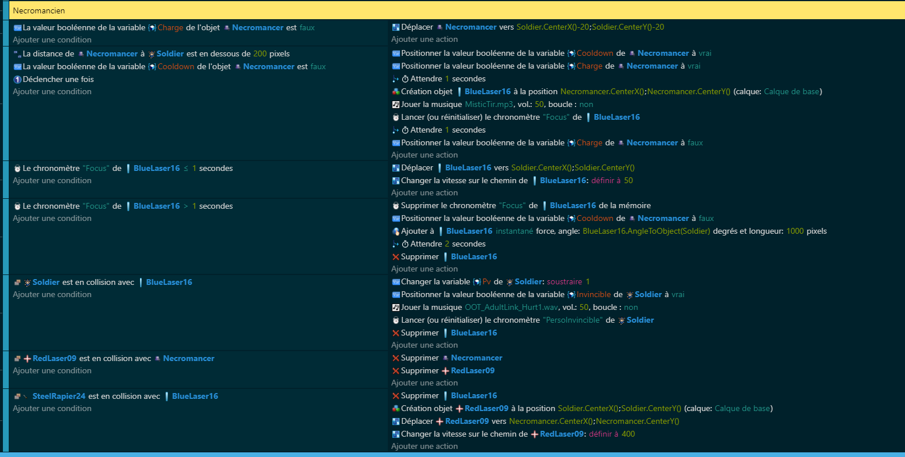

# Création d'Ennemis  🧟‍♂️🗡️

Maintenant que tu as ton personnage et ta carte, il est temps de pimenter les choses avec quelques ennemis coriaces. Dans ce tutoriel, on va introduire 4 types d'ennemis pour tester tes compétences : BigDemon, RockHead, Necromancer, et AngryPig.

Voici le [CheckPoint du projet]()

## BigDemon 👹

Le BigDemon est cet ennemi qui, frappant un mur, change de direction. Imagine-le comme une balle de flipper 🎱, imprévisible et excitant à esquiver.

Variables📊 :
- Direction : Détermine la direction de mouvement.
- Moved : Indique si le changement de direction a déjà eu lieu après une collision.

Pour s'attaquer à ces monstres, les mouvements sont simples mais efficaces : de gauche à droite ou de haut en bas, afin de ne pas submerger les joueurs dès le début 🏁.

Et pour les vaincre ? Si l'épée entre en contact, BigDemon est fini. Rien de plus satisfaisant que de voir disparaître son adversaire en un coup bien placé 💥.

## RockHead 🪨

Rencontre le RockHead, un ennemi résilient qui change d'animation lorsqu'il est touché. On dirait presque qu'il ressent la douleur de tes attaques. De plus, la vie de RockHead est réduite chaque fois qu'il est touché. Si la vie de RockHead atteint 0, il est supposé être détruit.

Variables 📊:
- Hit : A-t-il été touché ?
- Life : Ses points de vie restants.

## Necromancer 💀

Le Necromancer, avec sa charge d'attaque laser, amène la confrontation à distance. Il charge, se positionne, et vise avec précision, te forçant à rester en mouvement constant 🏃‍♂️.

Variables 📊:
- Charge : En cours de chargement d'attaque.
- Cooldown : Pour éviter les tirs en continu.

### Comportement

On va devoir lui rajouter un comportement de PathFinding c'est-à-dire que notre nécromancien vas chercher à rejoindre un endroit par n'importe quel chemin.

### Code

Le Necromancien est un ennemi qui a la capacité de tirer un laser sur le joueur. Pour cela, il utilise une variable Charge qui indique s'il est en train de charger son attaque et une variable Cooldown qui représente le temps restant avant qu'il ne puisse à nouveau tirer son laser.

Le code vérifie si la variable Charge est True, ce qui signifie que le Necromancien est en train de charger son attaque. Si c'est le cas, le Necromancien définit sa destination de déplacement (Pathfinding) vers la position du joueur (Soldier), moins 20 pixels en X et Y. Cela fait en sorte que le Necromancien se déplace vers le joueur pour tirer son laser.

Pour chaque ennemi, on ajoute cette touche d'anticipation et de stratégie pour enrichir ton gameplay.
Prêt à démontrer ta bravoure ? A tes armes, jeune héros, et que l'aventure commence ! 🚀

Après avoir mystérieusement donné vie à nos redoutables ennemis, le prochain arrêt de notre quête numérique sera l'élaboration de [l'Interface Utilisateur (UI)](https://github.com/g404-code-gaming/ZeldaDistanciel/blob/main/Création-Du-Jeu/3.Ajustement%20UI%20%26%20PV.md) 🖥️🎨.

