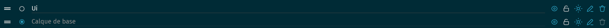
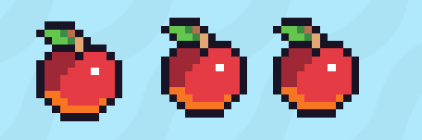
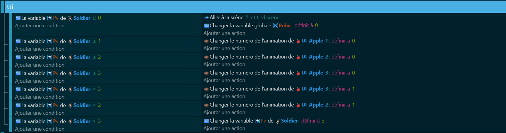

# Interface Utilisateur 🍎🗺️

L'interface utilisateur (UI) est vitale pour tout jeu, fournissant des informations cruciales et facilitant l'interaction entre le joueur et le jeu. Explorons comment intégrer une UI efficace et visuellement agréable à ton jeu, focalisée sur les points de vie (PV)💎. 

## Utilisation des Calques 🎨🖌️
Les calques dans GDevelop aident à organiser ta scène de manière efficace. Pense à eux comme des couches superposées qui gèrent la disposition des objets dans ton jeu. Un bon usage des calques te permettra de créer des effets de profondeur et une interface utilisateur claire :

Calques d'UI: Pour les points de vie et rubis, crée des calques spécifiques. Celui pour les PV et rubis se nommera "UI". Ainsi, tu auras un contrôle total sur la visibilité de ces éléments essentiels 🌟.

### Système de Points de Vie 🚑💔
Les points de vie sont l’essence de la survie dans ton jeu. Pour les représenter, utilise un objet symbolique, comme un cœur. Créer un calque "UI PV" te permet de placer ces objets symboliques à des endroits stratégiques sur ton écran, assurant une visibilité optimale pour le joueur.

Gérer les PV: À chaque perte de PV, change l'animation de l'objet PV pour refléter le nombre actuel de points de vie. Par exemple, un cœur plein pour un PV complet, et un cœur vide pour un PV perdu 🖤.

## Défi UI pour Ton Jeu Zelda-Like 🎨🖼️

Les héros, voici votre quête : Animer l'UI de votre jeu de manière à ce qu'elle ne soit pas juste informative, mais qu'elle devienne une partie vivante de l'aventure ! Voici les épreuves qui vous attendent :

Dynamisez les Points de Vie (PV) 🚑🔥 : 
Créez une animation où les cœurs de PV vibrent ou battent comme de vrais cœurs lorsque le joueur récupère de la vie ou est sur le point de mourir. Faites battre les cœurs de l'espoir !

Transitions UI 📲🎇 :
Ajoutez des transitions fluides et captivantes entre les différents écrans de jeu (menu, jeu, game over...). Une porte magique ? Un rideau mystique ? Que l'imagination soit votre guide.

Easter Egg sur L'UI 🥚🐉 :
Intégrez discrètement un easter egg dans votre UI, quelque chose qui ne serait révélé que par une combinaison spécifique d'actions ou après un certain accomplissement dans le jeu (Konami Code). Faites briller l'œil des curieux !

Partagez votre création pour que tout le monde puisse tester et apprécier les détails incroyables que vous avez incorporés dans votre UI. Que le meilleur gagne ! 🚀🎖️

🚀✨ Après avoir peaufiné l'Interface Utilisateur, nous plongerons dans le monde fascinant [des items](https://github.com/g404-code-gaming/ZeldaDistanciel/blob/main/Création-Du-Jeu/4.Items.md) 🗝️✨. Ces trésors numériques ajoutent une couche de stratégie et de profondeur à notre aventure, offrant aux héros des ressources précieuses pour triompher de leurs défis. Préparez-vous à enrichir votre arsenal avec ces joyaux de coding !
