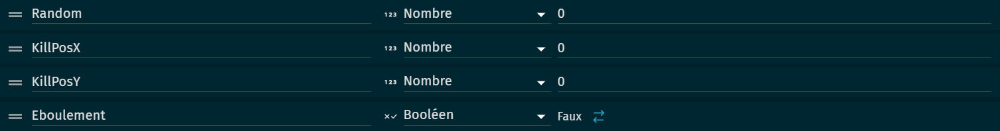
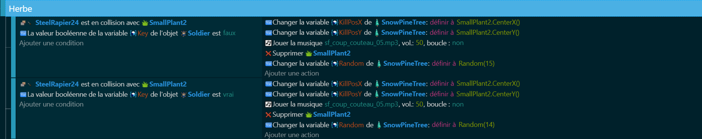
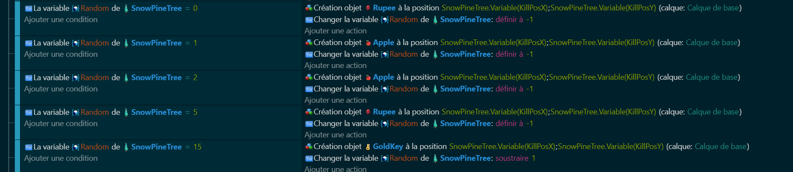
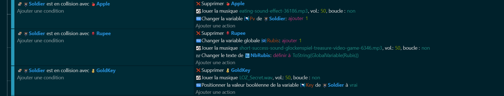

# Le Drop d'Items Aléatoire 🎁🌟
Pour ajouter du piment à l'aventure, introduisons un système de drop d'items aléatoire ! Cela signifie que, lorsqu'un joueur réalise certaines actions telles que casser de l'herbe, il a une chance de découvrir un trésor caché 🍀💎.

Télécharge le prélude à notre aventure ici (null) - À l'intérieur, tu trouveras un enchantement pré-configuré où le système de drop aléatoire et le conteneur à variables t'attendent déjà. Ce sol fertile n'attend que tes idées pour fleurir en une épopée des plus fascinantes 🌱💬.

Pour mettre en œuvre ce système palpitant, commençons par identifier les items trouvables en jouant les jardiniers avec l'herbe. Ensuite, chaque fois que de l'herbe est coupée, faisons appel à la main invisible du hasard pour décider si un item doit être révélé, et si oui, lequel (Pomme, Rubis, Key) 😮‍💨🎲.

Ce mécanisme introduit un élément de surprise exaltant dans le jeu, suscitant curiosité et excitations parmi les joueurs 🤩🎮.

## Conteneur à Variables 📦🔒
Dans notre créatif univers, un objet spécial, baptisé SnowPineTree, joue le rôle de coffre-fort pour nos précieuses variables. Bien que ce coffre soit invisible et relégué aux confins de la carte, son rôle est crucial dans la machinerie de notre système de drop aléatoire 🛡️🗝️.

Lorsque l'herbe tombe sous la lame du joueur, SnowPineTree enregistre l'événement avec soin, notant la position de la débroussailleuse dans les variables KillPosX et KillPosY. Et au cœur de ce système, SnowPineTree abrite également une variable aléatoire nouvellement générée, prête à décider du destin des items cachés 🌬️🔖.

Grâce à cette méthodologie, orchestrer le suspense des découvertes aléatoires devient un jeu d'enfant, permettant de maintenir l'aventure aussi fraîche que l'herbe sous les pieds des héros 🌿👑.

## En Action ⚔️🌾
Collision Épique : Lorsque l'épée entre en contact avec la verdure, vérifions si le destin sourit au héros. Si tel est le cas, nous immortalisons ce moment dans les annales de SnowPineTree, nous célébrons l'acte par un son triomphant, éradiquons l'herbe de notre vue, et nous confions notre sort à une génération aléatoire de nombres pour dévoiler les trésors cachés 🌪️🍃.

Cadeaux du Destin : Armés de notre talisman aléatoire, explorons la grâce du hasard. Si la chance est de notre côté, révélons sans attendre les richesses de la terre au point précis de leur découverte, et marquons ce moment de fortune avec une étoile dans notre constellateur de variables 🎊🗺️.

Chasse aux Trésors : Enfin, lorsque le destin et la dextérité mènent notre héros vers un objet de convoitise, que celui-ci soit ratifié dans notre quête, et que son souvenir soit précieusement gardé dans les replis de notre monde enchanté ✨🔍.

Avec cette touche d'enchantement et une pincée de mystère, embarque tes joueurs dans une quête où chaque brin d'herbe peut renfermer des secrets insoupçonnés. Allez, lancez-vous dans la création d'une aventure inoubliable ! 🚀🏰

## Défi Arc et Flèches 🏹💥
Objectif : Les étudiants doivent concevoir une quête où le joueur est chargé de trouver un arc et un ensemble de flèches cachés quelque part dans le monde. Ces objets ne seront pas découverts par un simple drop aléatoire ; le joueur devra résoudre des énigmes ou compléter des challenges spécifiques pour les obtenir.
🎯 Une fois l'arc et les flèches réunis, le joueur débloque une nouvelle compétence lui permettant de tirer des flèches. Cette compétence peut être essentielle pour progresser dans le jeu, ouvrir de nouvelles zones, ou vaincre certains ennemis.

Armés jusqu'aux dents avec notre collection d'items magiques, nous nous préparons à entrer dans l'arène pour le duel final contre [le boss](https://github.com/g404-code-gaming/ZeldaDistanciel/blob/main/Création-Du-Jeu/5.BossPart1.md) 🏆👾.
