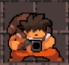
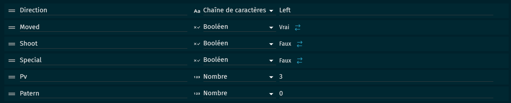
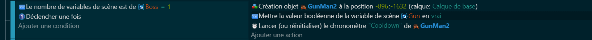
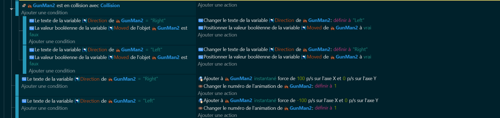
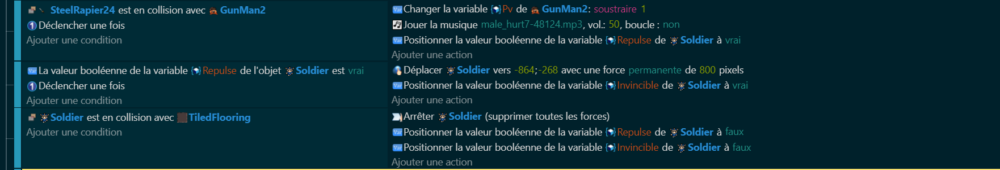

# Le boss (GunMan) 👹🏹

## Codage des Secrets du Boss 🧙‍♂️📊
Pour que notre boss devienne une légende, on doit initier sa magie par quelques variables-clés :
- Direction ⬅️➡️: Détermine le sens de sa danse mortelle. Modifier cette variable, c'est changer le rythme du combat.
- Moved 🚶‍♂️🔥: Indique si notre colosse avance ou défie les héros, immobile, tel une montagne.
- Shoot 💥🏹: Révèle si le moment est venu pour notre titan de déchaîner sa fureur en projets mortels.
- Spécial ⭐⚡: Lumière sur le spectacle – utilise-t-il son coup de grâce ou se contente-t-il de jouer avec ses adversaires ?
- PV ❤️‍🔥♻️: Les battements de son cœur sombre. À chaque coup porté, un fragment de sa force s'envole.
- Pattern 🔮🌌: L'oracle de ses actions. Un soupçon d'aléatoire pour un duel exaltant.

## Création de la Légende : Éveil du Boss 👹↗️
Ensuite, plonge dans la forge à boss. Selon les murmures de la variable "Boss", invoque le gardien de l'arène. Pour l'instant, "Boss" compte jusque 1, réveillant notre premier titan.

## Pas de Répit dans l'Arène : Mouvements du Titan 🏃‍♂️💨
Un boss figé ? Jamais ! Nous le guiderons dans une valse féroce de gauche à droite, utilisant des "Collision" comme frontières de ce bal effréné.

## L'Écho des Confrontations : L'Assaut contre le Géant 🗡️🛡️
Notre odyssée ne serait rien sans la bravoure. Ainsi, quand le fer rencontre la chair du monstre, il faiblit, perdant cœur et âme piece par piece, jusqu'à laisser tomber le précieux "BookBlue" en signe de défaite.

Préparez-vous, chers aventuriers du code, car [la prochaine étape](https://github.com/g404-code-gaming/ZeldaDistanciel/blob/main/Création-Du-Jeu/6.BossPart2.md) de notre quête épique nous plongera au cœur de la tempête ! 🔮💻

Dans la prochaine partie, nous allons coder avec courage les attaques dévastatrices de nos redoutables boss, et tisser avec sagesse le fil des points de vie (PV) qui définissent leur endurance face aux assauts des héros. 🛡️💥

