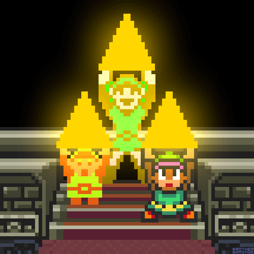

# Création d'un Jeu inspiré de Zelda avec GDevelop 5 en Distanciel 🏰🖥

Hey, les explorateurs du numérique ! 🖱 Prêts à plonger dans l'univers captivant du développement de jeux à distance ? Super, parce que nous avons une aventure extraordinaire en réserve pour vous. On va se lancer dans la création d'un jeu inspiré de Zelda, en utilisant GDevelop 5. Imaginez explorer des donjons secrets, combattre des créatures féroces et résoudre des énigmes complexes pour sauver un monde en péril... ça vous parle ? 🌌

S'attaquer à un projet inspiré de Zelda, c'est plonger au cœur d'une légende qui occupe une place royale dans la culture geek mondiale 🌟. Zelda n'est pas seulement un jeu, c'est un monument 🏰 dans l'histoire du gaming, adoré par des millions de fans à travers le globe 🌐. Son univers riche 🌲, ses personnages iconiques 🧝‍♂️ et ses énigmes ingénieuses 🤔 ont posé les fondations de ce qui fait un grand jeu d'aventure aujourd'hui.

## Pourquoi Zelda ? 
Parce que s'inspirer du meilleur est une excellente manière d'apprendre 📚. En démystifiant le processus derrière ces aventures épiques 🛡🗡, vous acquerrez non seulement des compétences en développement de jeux, mais embrasserez aussi une part essentielle de la culture geek 🕹. Zelda illustre l'importance du storytelling 📖, de la conception de niveaux captivants 🌈, et de la création d'expériences mémorables qui restent gravées dans le cœur des joueurs ❤️.

## Ce que vous allez découvrir 
Un univers de connaissances vous attend ! Vous allez maîtriser la création de personnages, programmer des actions et réactions complexes, gérer les interactions et collisions, intégrer des sons et des animations époustouflantes, et tant d'autres choses. À l'issue de cette quête, un jeu inspiré de Zelda, conçu par vos soins, sera prêt à éblouir votre entourage. Ça sonne bien, hein ? 😄

Prêt pour l'aventure ? Saisissez votre souris et votre clavier, mettez-vous confortablement et préparez-vous à tisser la légende de votre propre royaume. [C'est parti, guerriers du numérique !](https://github.com/g404-code-gaming/ZeldaDistanciel/blob/main/Création-Du-Jeu/1.Attaque%20et%20synchronisation.md) 🚀

